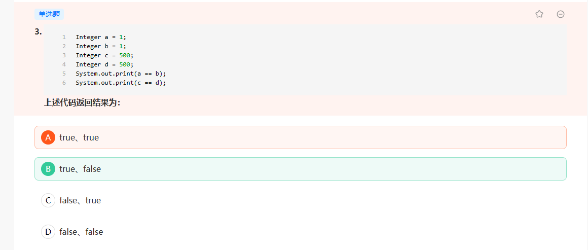
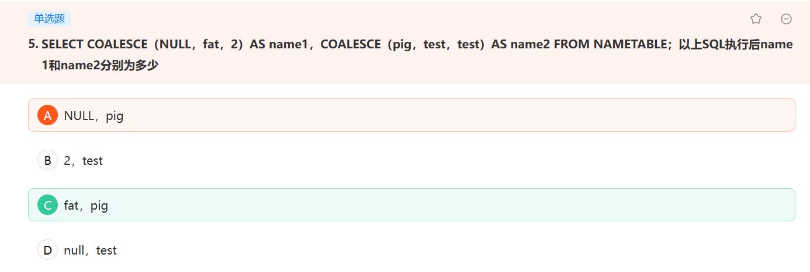
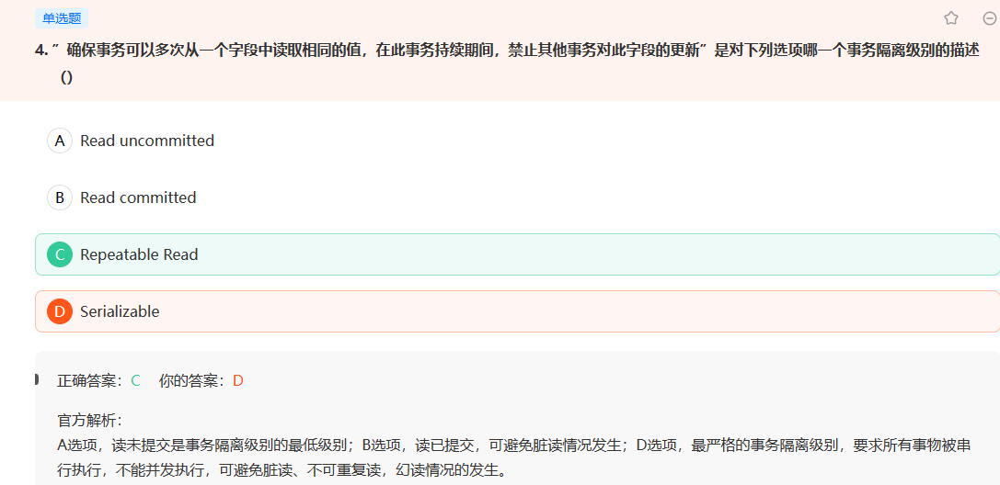
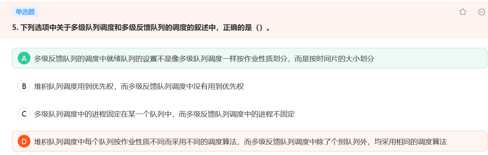

# 八股总结

[toc]

## Java

- StringBuilder和StringBuffer

  StringBuilder：效率高，线程不安全；

  StringBuffer：效率低，线程安全；

- jdk1.8之前，hashmap用数组+链表存储，之后使用数组+链表/红黑树存储

- == 和equals的区别？

> 对于基础类型来说，== 比较它们的值是否相等，没有equals；
>
> 对于包裹类来说，==比较他们的地址，equals比较他们的值。
>
> 对于Float和Double， java都重载了他们的equals方法，如果类型不同，即使值相同返回结果仍然是false：也好理解，因为精度不一样，凭什么比较

- Java数据库连接库JDBC用到哪种设计模式?

- 

> 关于Java多线程的知识要熟悉：
>
> Java实现多线程的方式有：
>
> 1. 继承Thread类，重载run（）
> 2. 实现Runable接口，实现run（）
> 3. 实现Callable接口，线程结束后有返回值

- 

> Integer在[-128，127]之间是有缓存的，在这里面不会创建新值，他们的内存地址都一样。

## 计网

## 数据库

- 
- 

> COALESCE函数，取第一个非NULL的值

- IP协议提供无连接的服务

## 设计模式

- 如果需要一个语言解释执行，并且可以将语言中的句子表示为一个抽象语法树的时候，对效率要求不高的情况下，应该选择何种设计模式？

>  什么是解释器模式？

- 行为类模式使用( )在类间分派行为.
>  什么是行为类模式？

## 操作系统

- 若一个进程拥有100个线程，这些线程属于用户级线程，则该进程在系统调度执行时间上占用（）个时间片

- 在UNIX 文件系统中，文件的路径名和磁盘索引节点之间是一一对应的，这样的说法正确吗？

- 

- 多道程序系统：在一台处理机上并发运行多个程序。多个独立的程序在管理程序的控制下，相互穿插的运行。体现为宏观上并行、微观上串行。

## 二进制

- 移位操作优先级大于按位异或操作

## 数据结构

- 什么是b树、b-树、b+树？

- 什么是线索二叉树？

