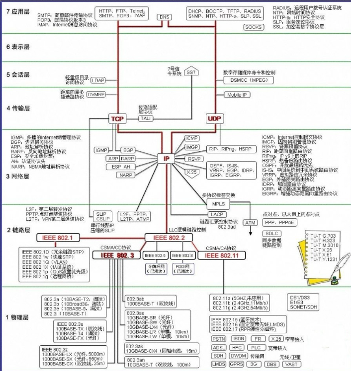
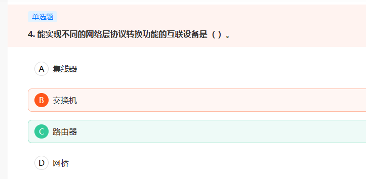
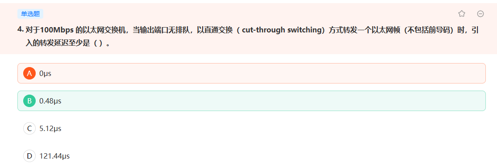
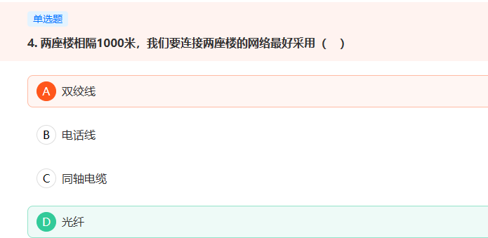

## 八股-计算机网络

[toc]

### 综合

##### 常见设备

- 物理层： （中继器，集线器）  
- 数据链路：（网桥，交换机）   
- 网络层：（路由器）   
- 传输层： (网关) 

##### 各种协议

### 应用层

##### Nmap

Nmap是Linux下的网络扫描和嗅探工具包。  

  其基本功能有三个： 

  一是探测一组主机是否在线； 

  二是扫描主机端口，嗅探其提供的网络服务； 

  三是推断主机所用的操作系统 。

### 传输层

##### 粘包问题

TCP粘包，就是发送发送的多个数据包，到达接收方后粘连在一起，导致数据包不能完整体现发送的数据。

UDP不存在粘包问题，因为

1. UDP发送时未经过Nagle优化，不能将多个小包一次性发送出去
2. 接收时，采用链式结构记录UDP包，每次recv只能从socket缓冲区中读出一个包

##### UDP载荷

UDP最大载荷为1472

### 网络层

##### 网络协议之间的转换

> 路由器连接两个或多个网络的硬件设备，在网络间起网关的作用，读取每一个数据包中的地址然后决定如何传送的专用智能性的网络设备。通常是一个计算机，它能够理解不同的协议，例如某个局域网使用的以太协议，因特网使用的TCP/IP协议。这样，路由器可以分析各种不同类型网络传来的数据包的目的地址，把非TCP/IP网络的地址转换成TCP/IP地址，或者反之；再根据选定的路由算法把各数据包按最佳路线传送到指定位置。所以路由器可以把非TCP/ IP网络连接到因特网上。

##### 自治系统

OSPF（开放最短路径优先协议）：自治系统内部；

BGP（边界网关协议）自治系统之间。

##### IP地址划分

-   A类网络的IP地址范围为：1.0.0.1－126.255.255.254； 
-   B类网络的IP地址范围为：128.1.0.1－191.255.255.254； 
-   C类网络的IP地址范围为：192.0.1.1－223.255.255.254 

### 数据链路层

##### 交换机

> 以太网交换机主要有直通式和存储转发式交换模式 
>
>   1）直通式交换机只检查帧的目的地址，帧在接收后能马上被传出去。速度快，但缺乏智能性和安全性，无法支持具有不同速率的端口的交换 
>
>   2）存储转发式交换机先将接收到的帧缓存到高速缓存器中，并检查数据是否正确，确认无误后通过查找表转换成输出端口将该帧发送出去。如果发现帧有错，就将其丢弃。存储转发式的优点是可靠性高，并能支持不同速度端口间的转换，缺点是延迟较大

直通式交换机只检查数据包的包头（包括7个字节的前同步码+1字节帧开始界定符+6字节同步地址，共14字节），当提莫说明不包括前导码时，只检查6个字节的目的地址。

转发时延6B / 1000Mbps = 0.48us

##### 信道划分协议

1.  时分多路复用（TDM）：把时间划分为若干个时间帧，把每个时隙分配给N个节点中的一个。          
2.  频分多路复用（FDM）：把信道划分为多个频段，每个节点使用一个频段          
3. 码多分址（CDMA）：为每一个节点分配不同的编码，然后每个节点用它唯一的编码对发送的数据进行编码。这样即使多个节点的信息杂糅在一起也能够让各自的接收方正确接收信息。

##### 随机访问协议

-  载波侦听多址访问（CSMA）：先听后发，边发边听，冲突停发，随机延迟后重发 

  其中带碰撞检测的CSMA（CSMA/CD）用于有线局域网如以太网中， 

  而带碰撞避免的CSMA （CSMA/CA）用于无线局域网如802.11中。          

- 分段（或时隙）ALOHA：边发边听，冲突停发，随机延迟后重发

> 有人将 CSMA/CD的工作过程比喻成：很多人在一间黑屋子中举行讨论会，参加会议的人只能听到其他人的声音。
>
> 每个人在说话前必须倾听【先听后发】，只有等会场安静下来后，他才能发言。
> 人们将发言前要监听来确定是否已经有人在说话的动作称为【载波侦听】；
> 在会场安静的情况下，每个人都有说话的机会称为【多路访问】；
> 如果在同一时刻有两人或两人以上的人同时说话，大家就无法听清任何一个人的发言【发生冲突】；
> 发言人在说话的过程中要及时发现是否发生冲突【冲突检测】。
> 如果发言人发现冲突已经发生，此时他需要停止讲话【冲突停止】，然后随机后退延迟，再次重复上述过程【延迟重发】，直至讲话成功。
> 如果失败多次，他可能会放弃这次发言的想法。

##### 以太网

> 采用带有冲突检测的载波侦听多路访问（CSMA/CD【Carrier Sense Multiple Access with Collision Detectio】）控制方法的总线型Ethernet，简称以太网。
>
> 采用令牌控制的令牌总线型（Token Bus）局域网，简称Token Bus或令牌总线网
>
> 采用令牌控制的令牌环状（Token Ring）局域网，简称为Token Ring或令牌环网
>
> 这三种局域网主要分为两类：总线型和环状拓扑

> 令牌是一种特殊结构的控制帧，用来控制节点对总线的访问权。任何节点只有在获取令牌后才能使用总线发送数据

Token Bus与Token Ring方法需要完成大量的环维护工作，必须有一个或多个结点完成下列环维护工作：①环初始化；②新结点加入环；③结点从环中撤出；④环恢复；⑤优先级。 

### 物理层

##### 网线

双绞线最大传输距离为100米；

同轴电缆最大800米。